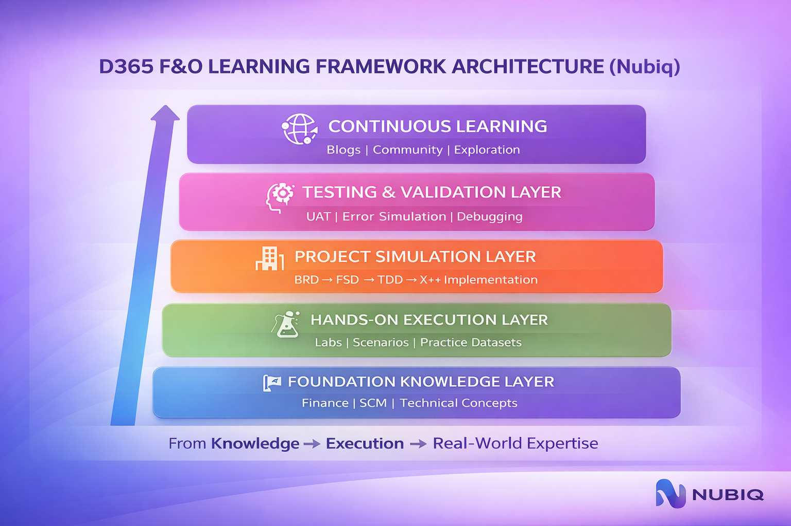
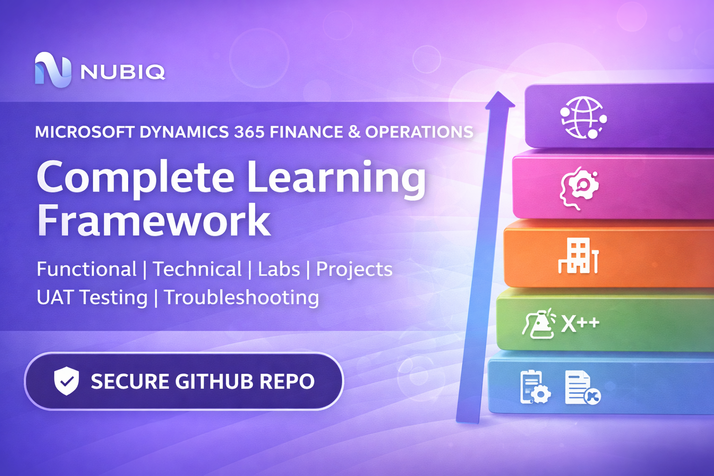

  

 

# 🚀 Microsoft Dynamics 365 Finance & Operations  
## Complete Learning & Real-World Project Framework (Nubiq)

---

## 🧭 Framework Architecture

  

> This framework follows a layered approach — from foundational knowledge to real-world execution and continuous learning.
 

---

## ⚡ Quick Navigation

- 📘 **Foundation** → [Start Here](./01-Foundation)  
- 🧪 **Hands-On Labs** → [Practice](./02-Hands-On-Labs)  
- 🏢 **Project Simulation** → [Real Project](./03-Project-Simulation)  
- 🧪 **Testing & UAT** → [Validation](./04-Testing-UAT)  
- 📊 **Datasets** → [Data](./05-Datasets)  
- 📚 **Reference** → [Learn More](./06-Reference)

 
---

## 🌟 Overview

Learning Microsoft Dynamics 365 Finance & Operations (D365 F&O) can be overwhelming.

Most resources are:
- Scattered across blogs and videos  
- Focused only on theory  
- Missing real-world project context  

👉 This repository provides a structured, real-world learning path designed to simulate actual D365 F&O project experience.

This is a **structured, end-to-end learning framework** designed to take you from:

> **Beginner → Intermediate → Advanced → Project-Ready Consultant**

---

## 🚀 Where to Start

If you're new, follow this learning path:

1. 📘 Start with [Foundation](./01-Foundation)  
2. 🧪 Move to [Hands-On Labs](./02-Hands-On-Labs)  
3. 🏢 Work through [Project Simulation](./03-Project-Simulation)  
4. 🧪 Practice [Testing & UAT](./04-Testing-UAT)  
5. 📚 Explore [Reference](./06-Reference)  

👉 This sequence mirrors a real-world D365 F&O project lifecycle.

---

## 🎯 What This Framework Covers

✅ Finance Functional (GL, AP, AR, etc.)  
✅ Supply Chain Management (SCM)  
✅ Technical (X++, integrations, architecture)  
✅ Hands-on labs with datasets  
✅ Real-world project simulation  
✅ UAT testing and validation  
✅ Troubleshooting & production mindset  

---

## 🧭 Learning Path Structure

### 🔰 Phase 1 – Foundation
Understand core concepts and modules.

📁 `/01-Foundation`
- Finance Functional Guide  
- SCM Functional Guide  
- Technical Guide  

---

### 🧪 Phase 2 – Hands-On Learning
Build real system skills.

📁 `/02-Hands-On-Labs`
- Step-by-step lab workbook  
- Blog-based lab guide  

📁 `/05-Datasets`
- Practice dataset  
- Advanced dataset  

---

### 🏢 Phase 3 – Project Simulation
Learn how real implementations work.

📁 `/03-Project-Simulation`
- BRD (Business Requirement Document)  
- FSD (Functional Specification Document)  
- TDD (Technical Design Document)  
- X++ Sample Solution  

---

### 🧪 Phase 4 – Testing & Validation
Develop enterprise-level thinking.

📁 `/04-Testing-UAT`
- UAT test cases  
- Project execution tracker  
- Error simulation dataset  
- Troubleshooting guide  

---

### 🧠 Phase 5 – Continuous Learning

📁 `/06-Reference`
- Top D365 learning resources  

---

## 🔄 Recommended Learning Order

1. Foundation (Functional + Technical)  
2. Hands-on Labs + Datasets  
3. Project Simulation (BRD → FSD → TDD → Code)  
4. UAT + Error Simulation  
5. Continuous Learning  

---

## ⏱️ Suggested Timeline

| Phase | Duration |
|------|--------|
| Foundation | 1–2 Weeks |
| Hands-On Labs | 2 Weeks |
| Project Simulation | 2 Weeks |
| Testing & UAT | 1 Week |

---

## 💼 Real-World Value

This framework is designed based on actual enterprise D365 F&O project experience, including integrations, reporting, troubleshooting, and production scenarios.

---

## 🎯 Final Outcome

By completing this framework, you will be able to:

- Understand end-to-end D365 F&O architecture  
- Execute both functional and technical tasks  
- Participate confidently in real-world implementations  
- Troubleshoot production issues effectively  
- Think like a consultant / solution architect  

---

## 👥 Who This Is For

- Beginners starting with D365 F&O  
- Developers transitioning into ERP  
- Functional consultants  
- Technical consultants (X++)  
- Anyone preparing for real-world implementations

---

## 🌐 About Nubiq

**Nubiq** focuses on building intelligent, real-world, enterprise-grade technology solutions and learning frameworks.

This repository reflects practical experience in:
- System architecture  
- Integration design  
- Reporting pipelines  
- Production issue troubleshooting  

---

## 🤝 Contributing

Contributions, improvements, and feedback are welcome!

Feel free to:
- Raise issues  
- Suggest enhancements  
- Share improvements  

---

## ⭐ Support

If you find this useful:

👉 Star this repository  
👉 Share with your network  
👉 Help others learn  

---

## 🔗 Connect

- 🌐 Website: https://nubiq.pro  
- 💼 LinkedIn: https://www.linkedin.com/in/venkatsrinivasan369/ 

---

## ⚠️ Disclaimer

This framework is for learning and educational purposes.  
It is designed to simulate real-world scenarios based on practical experience.

---

🔥 **Built with real-world experience. Designed for real-world readiness.**
